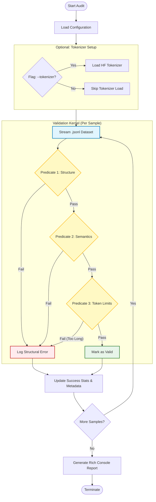

# 📘 Deep Dive: Dataset Validation Architecture

**Target Audience:** QA Engineers, Data Scientists, and MLOps Architects.
**Subject:** Automated Quality Assurance and Structural Integrity Verification for LLM Training Data.
**File Reference:** `src/validate_dataset.py`

---

## 1. Abstract & Mathematical Formulation

The validation process can be formalized as a set of predicates $P = \{p_1, p_2, ..., p_n\}$ applied to the dataset $D$.

Let $S$ be the schema definition of a valid training example.
For each sample $x \in D$, the validation function $V(x)$ is defined as:

$$ V(x) = \begin{cases} 
\text{Valid} & \text{if } \forall p \in P, p(x) \text{ is True} \\
\text{Invalid} & \text{otherwise}
\end{cases} $$

Where specific predicates include:
*   $p_{struct}$: Structure adheres to the schema (e.g., $x_{messages} \neq \emptyset$)
*   $p_{roles}$: Message roles follow the required sequence $(r_{dev} \rightarrow r_{user} \rightarrow r_{asst})$
*   $p_{token}$: Token length $L(x) \leq L_{max}$ (optional tokenizer check)

The overall dataset validity score $\mu$ is:
$$ \mu = \frac{1}{|D|} \sum_{x \in D} \mathbb{I}(V(x) = \text{Valid}) $$

---

## 2. System Architecture Logic

The validation module operates as a strictly typed audit pipeline, processing samples in $O(N)$ time.



---

## 3. Deep Logical Analysis: The Predicates

### A. Structural Integrity (`validate_sample_structure`)
This function implements a series of hierarchical checks. It treats the JSON object as a tree and traverses specific paths to ensure existence and type correctness.

**Key Checks:**
1.  **Topology Check:** Does the root have `metadata`, `tools`, and `messages`?
2.  **Tool Definition Audit:**
    *   $\forall t \in x_{tools}$: Does $t$ have a `function` object?
    *   Does `function` have `name` and `parameters`?
3.  **Conversation Flow Audit:**
    *   **Cardinality:** $|x_{messages}| \ge 2$? (Must have at least user & assistant).
    *   **Sequence:** $m_0.role == 'user'$ (in V1) or $m_0.role == 'developer'$ (in V2/FunctionGemma).
    *   **Completeness:** Does the Assistant message contain either textual `content` OR structured `tool_calls`? (Exclusive OR logic is often preferred for strict function calling, though FunctionGemma allows mixed).

### B. Tool Call Verification
If `tool_calls` are present, strict schema validation applies:
$$ \forall c \in m_{asst}.tool\_calls: $$
*   $c.type == \text{'function'}$
*   $c.function.name \neq \text{null}$
*   $c.function.arguments$ is a valid JSON-serialized string (not a dictionary object).
    *   *Expert Note:* This common error (passing dict instead of string) causes immediate failures in training because the LLM learns to predict character tokens, not Python objects.

### C. Tokenizer Feasibility (`validate_with_tokenizer`)
**Concept:** *Computational Feasibility Check*
Even if a sample is structurally valid, it is useless if it exceeds the model's context window.

1.  **Template Application:** Transforms the abstract list of messages into the raw string format using `tokenizer.apply_chat_template()`.
    *   *Why?* This catches errors where the chat template (Jinja2) fails to handle specific roles or tool formats.
2.  **Encoding:** Converts string $\rightarrow$ integers (tokens).
3.  **Bounds Check:** $Len(Tokens) \le L_{max}$.

---

## 4. Statistical Observation

The validation script functions not just as a gatekeeper (Pass/Fail) but as an **Analytics Tool**. It performs a single-pass aggregation of dataset distributions.

**Why track this during validation?**
Tracking these metrics *during* validation prevents the "Hidden Stratification" problem, where a dataset is technically valid but functionally useless (e.g., 99% of samples are from one domain).

*   **Dialect Distribution:** Monitors class balance ($\text{Gulf} \approx \text{Egyptian}$).
*   **Domain Coverage:** Ensures all 8 domains are represented.
*   **Tool Usage Frequency:** Identifies over-represented functions (`get_weather` often dominates) vs under-represented ones.

---

## 5. Usage Scenarios

### Scenario A: CI/CD Pipeline
Run validation as a blocking step before triggering a training job.
```bash
python src/validate_dataset.py --input data.jsonl --tokenizer --model google/gemma-2b-it
```
*Result:* Returns exit code 1 if `errors > 0`, stopping the potentially expensive GPU training run.

### Scenario B: Data Debugging
When training loss doesn't converge, run validation to check for systemic issues (e.g., malformed tool arguments).

---

## 6. Key Learning Outcomes

1.  **Fail Fast:** Validation logic should be strict and run *before* any tensor operations. Catching a recursive JSON error here takes milliseconds; catching it during training costs hours of GPU time.
2.  **Types vs. Tokens:** Validating Python types (`isinstance(x, dict)`) is different from validating Tokenizer compatibility. Both are required.
3.  **Argument Serialization:** The most subtle bug in Function Calling datasets is passing `{"city": "Cairo"}` (dict) instead of `"{\"city\": \"Cairo\"}"` (string). This script explicitly guards against that.
